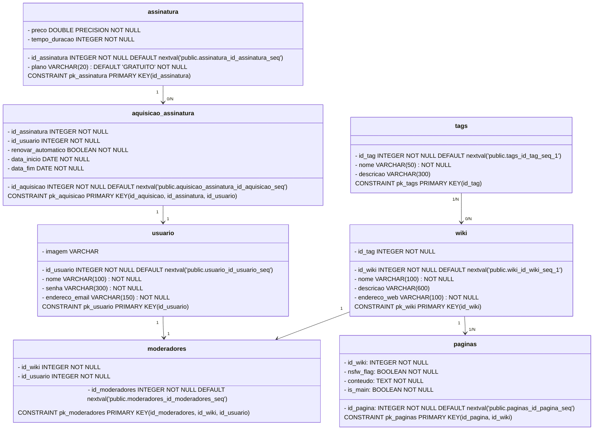

# Wiki_LabEngenharia
## Tabelas


### Observações:
Configurar o localhost do banco de dados em appsettings.json

Configurar a chave secreta do JWT no appsettings.json

Quando estiver conectado ao banco de dados, descomentar a função em RegisterService.cs:
* /*if (await _db.Users.AnyAsync(u => u.Email == dto.Email)) 
throw new ApplicationException("E-mail já cadastrado.");*/


## Instale as bibliotecas dos pacotes para net8.0:

```dotnet
dotnet add package BCrypt.Net-Next
dotnet add package Microsoft.AspNetCore.Authentication.JwtBearer
dotnet add package Microsoft.AspNetCore.Authorization
dotnet add package Microsoft.AspNetCore.Mvc.RazorPages
dotnet add package Microsoft.EntityFrameworkCore
dotnet add package Microsoft.IdentityModel.Tokens
dotnet add package Npgsql.EntityFrameworkCore.PostgreSQL
dotnet add package Swashbuckle.AspNetCore
dotnet add package System.IdentityModel.Tokens.Jwt
dotnet add package System.Text.RegularExpressions
```

Caso haja erros por causa de versões incompatíveis, acesse o gerenciador de pacotes NuGet do visual studio:


# Use essas versões:

 BCrypt.Net-Next                                       4.0.3

 Microsoft.AspNetCore.Authentication.JwtBearer         8.0.14

 Microsoft.AspNetCore.Authorization                    8.0.0

 Microsoft.AspNetCore.Mvc.RazorPages                   2.3.0

 Microsoft.EntityFrameworkCore                         9.0.9

 Microsoft.IdentityModel.Tokens                        8.14.0

 Npgsql.EntityFrameworkCore.PostgreSQL                 9.0.4

 Swashbuckle.AspNetCore                                8.1.4

 System.IdentityModel.Tokens.Jwt                       8.14.0

 System.Text.RegularExpressions                        4.3.1
